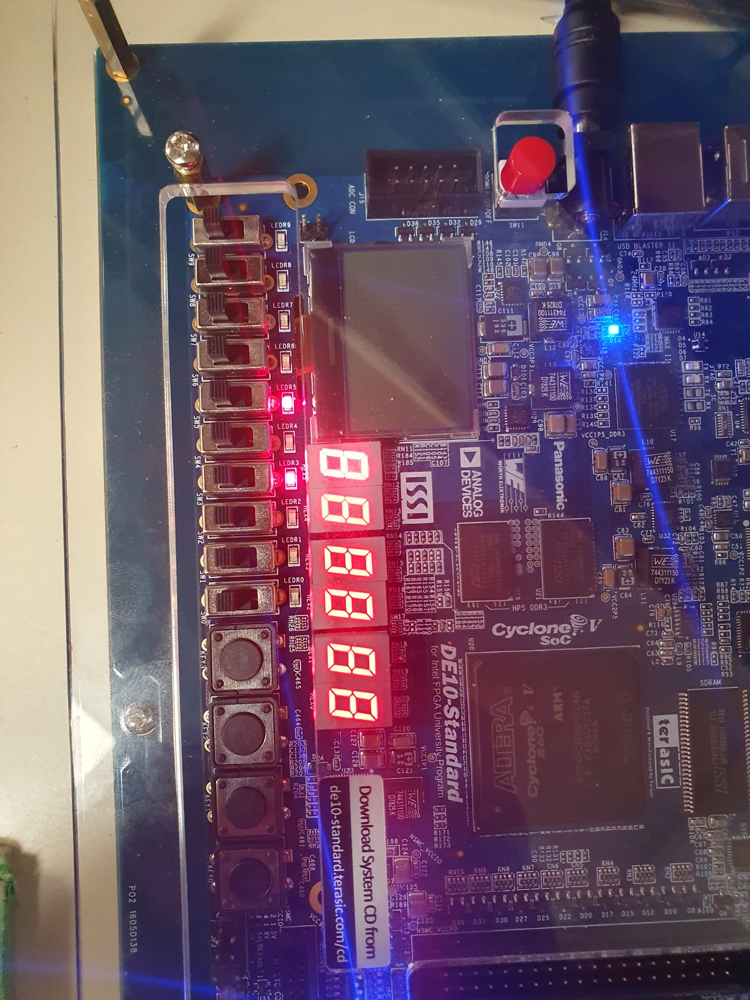

<p align="left">  </p>

# tp_Linux


# TP Linux Embarqué

GUIFFAULT GABRIEL JACQUOT NOLAN


## 1 Prise en main
Note : en cas de doute, appelez votre prof avant de faire une connerie !

### 1.1 Préparation de la carte SD
Avant de commencer, il faut flasher la carte SD avec l’image fournie par Terasic. Elle est disponible sur le lien ci-dessus. Il s’agit du fichier suivant :

VEEK_MT2S_LXDE/VEEK_MT2S_LXDE.img

Sous Windows Utilisez l’outile Win32DiskImager. Des tutoriels sont disponibles
en ligne. Il faudra l’installer au besoin.

### 1.2 Démarrage
Insérez la carte SD fraichement programmée, branchez la carte VEEK-MT2S et
allumez-la : bouton rouge ! Ça clignote de partout et un linux se lance.

Prenez un peu de temps pour explorer les différents programmes fournis sur
le bureau de Lxde.

Mais sans clavier, ce n’est pas très pratique pour programmer cette « brique ».
Nous allons y remédier.

### 1.3 Connexion au système

### 1.3.1 Liaison série
Le premier moyen pour se connecter sur un objet embarqué, c’est très souvent
par le port série. Une fois que l’on aura eu accès au DE-10, on configurera le
réseau, pour pouvoir ensuite y accéder via ssh.

Tout d’abord, déterminer le port à utiliser pour se connecter à la carte.
Il y a plusieurs ports USB sur la carte :

— 2 hôtes usb A

— 1 usb B : max blaster pour la programmation

— 1 usb mini : uart to usb ← c’est celui-là qui nous intéresse.

### 1.3.2 Utilisez un logiciel de liaison série
Sous Windows : Utilisez le logiciel PuTTy pour vous connecter grace au port
série. Sélectionnez serial, et à l’aide du panneau de configuration de windows,
cherchez le port COM de votre carte SoC. Pour la vitesse, entrez 115200.
Une fois connecté au SoC :

Pour vous identifier :

— login : root

— password : aucun (vraiment rien, ne tapez que sur entrée)

Pour l’exercice, nous allons redémarrer le SoC pour observer la séquence de
démarrage.
```
reboot
```
Loggez-vous à nouveau. L’image copiée précédemment n’occupe pas la totalité de la carte SD. Quelle est la taille occupée ? Utilisez la commande suivante :
```
df -h
```
Des scripts sont fournis pour augmenter la taille du système de fichiers et
profiter de l’ensemble de la carte SD :
```
./expand_rootfs.sh
```
Rebootez la carte (proprement !), puis, une fois loggé :
```
./resize2fs_once
```
Vérifiez que vous avez bien 32GB de disponible sur la carte SD.
<p align="center">  </p>
<p align="center">  </p>

### 1.3.3 Configuration réseau

— Branchez la carte VEEK sur le switch via un câble réseau,

— À l’aide de la commande ifconfig, vérifiez que la carte dispose d’une
adresse IP,
<p align="center">  </p>
— Éditer le fichier /etc/network/interfaces de la manière suivante :
```
# interfaces(5) file used by ifup(8) and ifdown(8)
# Include files from /etc/network/interfaces.d:
source-directory /etc/network/interfaces.d
auto eth0
iface eth0 inet dhcp
allow-hotplug eth0
```
Pour ces modification, vous allez devoir utiliser vim de la façon suivante :

— Éditez le fichier avec la commande vim /etc/network/interfaces,

— Effacez toutes les lignes inutiles en appuyant deux fois sur la touche d

— Insérez une nouvelle ligne en appuyant sur o. Cette touche vous bascule
en mode -- INSERT --

— À partir de là vous pouvez taper le contenu du fichier,

— Quand c’est terminé, tapez sur la touche Echap pour revenir en mode command

— Tapez :wq puis sur entrée pour sauvegarder et quitter vim.

<p align="center">  </p>
Rebootez une nouvelle fois, et là normalement vous allez avoir une adresse IP
correcte. Vérifiez avec ifconfig.

— Si tout est correct, vous devez pouvoir pinger avec le PC dans les 2 sens

ping <adresse_ip>

— Vérifiez que dans le fichier /etc/ssh/sshd_config, la ligne suivante est
présente :

PermitEmptyPasswords yes
<p align="center">  </p>
— Vous devriez pouvoir vous logger en ssh sur la carte VEEK, avec Putty ou
par le terminal :

ssh root@<IP_VEEK>
<p align="center">  </p>
Une fois connecté en ssh, vous pouvez fermer la liaison série. Sur minicom
ça se fait avec la combinaison suivante :

Ctrl+A puis Q

### 1.4 Découverte de la cible

### 1.4.1 Exploration des dossiers /sys/class et /proc
Explorez un peu votre environnement, par exemple :

— Répertoires présent sous la racine

— Dans /proc : cpuinfo, ioports, iomem. Utilisez les commandes cat, less
ou more pour voir le contenu des fichiers
<p align="center">  </p>

— Le répertoire /sys/class contient des entrées nouvelles (par raport à un
PC classique), saurez vous les reconnaître ? En particulier, explorez les répertoires suivants :

— /sys/class/leds/fpga_ledX/

— /proc/ioport

— /proc/iomem

— /proc/device-tree/sopc@0 à comparer avec le fichier iomem.
<p align="center">  </p>

### 1.4.2 Compilation croisée

Il existe deux méthodes pour compiler un programme sur le SoC :

— Directement sur les SoC à l’aide du gcc qui y est installé (gcc -v)

— Sur le PC (beaucoup plus puissant), en utilisant un chaine de compilation
croisée sous linux (apt install gcc-arm-linux-gnueabihf sous Ubuntu).

Vous allez utiliser la deuxième solution. Pour cela, une VM contenant un linux
déjà configuré va vous permettre de faire la compilation directement sur le PC :

— Lancez VirtualBox et importez la VM suivante VM-SOC-2019.ova

— Sur les PC Windows de l’école, modifiez le répertoire "Dossier de base" (Machine Base Folder) dans
D:\SOC-2021\VirtualBox VMs pour éviter d’exploser vos quotas ENSEA.

— Lancez l’importation.

— Avant de lancer la VM, modifiez le dossier partagé en le faisant pointer sur
un dossier dans "Mes Documents" (ou ailleurs).

— Lancez la VM, loggez vous (login : ensea, password : ensea).
Dans la VM, le répertoire src dans le home de ensea, est le dossier partagé.

Tout ce que vous y placer est visible depuis la VM et depuis le système Hôte.

### 1.4.3 Hello world !

Réalisez un programme "Hello World !", compilez-le et testez-le sur la carte
SoC.

— Pour compiler sur la VM, utilisez le cross-compilateur :
arm-linux-gnueabihf-gcc hello.c -o hello.o

Vous pouvez vérifier le type de vos exécutables avec la commande file. Essayez de l’exécuter dans la VM. Que se passe-t-il ?
Comme la carte SOC est sur le réseau, vous pouvez copier l’exécutable directement sur la cible :

scp chemin_sur_VM root@IP_DE_LA_CARTE_SOC:chemin_sur_SOC

Tester sur la carte.
### 1.4.4 Accès au matériel

Un certain nombre de drivers sont fournis. Comme tous les drivers sous Linux,
ils sont accessible sous forme de fichiers. Par exemple pour allumer l’une des LED
rouge de la carte, il suffit d’écrire un ’1’ dans le bon fichier.
```
echo "1" > /sys/class/leds/fpga_led1/brightness
```
Tester d’allumer et d’éteindre d’autres LED.
<p align="center">  </p>

### 1.4.5 Chenillard (Et oui, encore !)

Plutôt que de passer par la commande echo, on peut écrire un programme C
qui va ouvrir et écrire dans ces fichiers. Écrire un programme en C qui réalise un
chenillard.
## 2 Modules kernel (TP2)

### 2.0 Reprise du TP1

Assurez vous de pouvoir communiquer avec la carte VEEK en ssh ou via le port
série. Vous devez pour cela reprendre la configuration du réseau faite au TP1.

### 2.1 Accès aux registres

Avant de travailler avec les modules, vous allez créer un programme qui accède directement aux registres depuis l’espace utilisateur.
À cause de la virtualisation de la mémoire, il n’est pas possible d’écrire facilement dans un registre comme nous en avons l’habitude. Il faut en effet remapper
la mémoire pour demander à l’OS de nous fournir une adresse virtuelle.
Pour cela, on utilisera la fonction mmap()

Le registre du GPIO connecté aux LED est disponible à l’adresse suivante :

— 0xFF203000

Cette méthode permet de prototyper rapidement, mais pose quelques problèmes et limites. Quels sont-ils ?

### 2.2 Compilation de module noyau sur la VM

Pour ce TP, vous allez développer vos propres modules noyau. Vous allez avoir besoin des sources du noyau cible (en fait en théorie il faut seulement les includes).
Il nous faut les sources exactes du noyau sur lequel le module va être chargé.
Pour compiler des modules noyau dans la VM, vous aurez besoin des paquets
suivant :
```
sudo apt install linux-headers-amd64
sudo apt install bc
```

À partir du Makefile et du fichier source hello.c disponibles sur moodle,
compilez votre premier module.
Utilisez modinfo, lsmod, insmod et rmmod pour tester votre module (à utiliser
avec sudo) : chargez le et vérifiez que le module fonctionne bien (sudo dmesg).
Pour la suite, tester les programmes suivants (voir cours)
— utilisation de paramètres au chargement du module
— création d’un entrée dans /proc
— utilisation d’un timer

<p align="center">  </p>

### 2.3 CrossCompilation de modules noyau

À cause de la puissance limitée du processeur de la carte cible, la compilation,
en particulier la compilation de modules noyau, est relativement longue. Nous
allons donc, une fois encore, cross-compiler les modules noyau pour la carte SoC,
à l’aide de la VM.

### 2.3.0 Récupération du Noyau Terasic (c’est déjà fait dans la VM !)

Les commandes suivantes permettent de récupérer les sources du noyau actuellement en fonctionnement sur la carte VEEK :
```
git clone https://github.com/terasic/linux-socfpga/
git checkout 6b20a2929d54
git config core.abbrev 7
```
